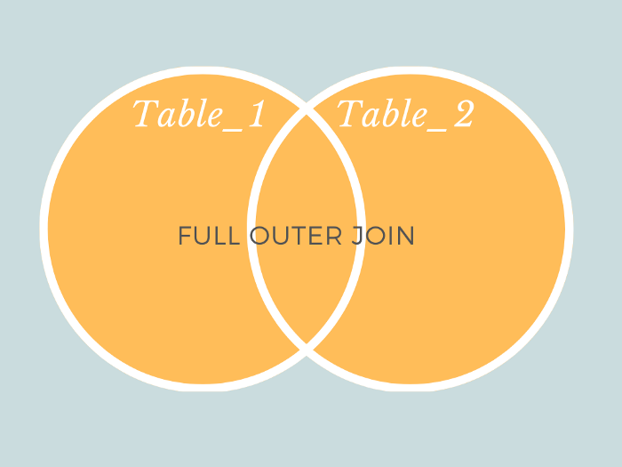

# AMA Session

## 1. Difference between DELETE and TRUNCATE

Delete and truncate both commands can be used to delete data of the table.

Delete is a DML command whereas truncate is DDL command. Truncate can be used to delete the entire data of the table without maintaining the integrity of the table. On the other hand , delete statement can be used for deleting the specific data. With delete command we can’t bypass the integrity enforcing mechanisms.

TRUNCATE query

    TRUNCATE TABLE tableName;

DELETE query

    DELETE FROM tableName WHERE condition;

## 2. What is currying in Java Script?

**Currying** is a technique of evaluating function with multiple arguments, into sequence of functions with single argument. In other words, when a function, instead of taking all arguments at one time, takes the first one and return a new function that takes the second one and returns a new function which takes the third one, and so forth, until all arguments have been fulfilled.

For Example -

    <html>
    <body>
    
    </body>
    </html>`

In the following example,since no currying is used, all the parameters were passed at once `(volume(11,2,3))` to the existing function to calculate the volume.

### Output

`66`

    <html>
    <body>
    
    </body>
    </html>

In the following example,since currying is used,parameters were passed one by one `(volume(11)(2)(3))` until the last function called the last parameter .

## 3. Difference between UNIQUE and DISTINCT in SQL

The main difference between Unique and Distinct in SQL is that Unique helps to ensure that all the values in a column are different while Distinct helps to remove all the duplicate records when retrieving the records from a table.

Unique is a constraint in SQL that allows one or more fields or columns of a table to uniquely identify a record in a database table. But, Distinct is command used with ‘select’ that helps to return distinct or different values in the result set. Thus, this explains the main difference between Unique and Distinct in SQL.

| UNIQUE                                                                                                                 | DISTINCT                                                                                            |
| ---------------------------------------------------------------------------------------------------------------------- | --------------------------------------------------------------------------------------------------- |
| Constraint in sql that allow one or more fields or column of a table to uniquely identify a record in a database table | Constraint used with **SELECT** that helps to return distinct or different values in the result set |
| Prevent two records from having identical values in a column                                                           | Helps remove duplicate values when retrieving data                                                  |

## 4. What are promises in Java Script

**Promises** are used to handle asynchronous operations in JavaScript. They are easy to manage when dealing with multiple asynchronous operations where callbacks can create callback.

### A Promise has four states:-

1. **fulfilled**: Action related to the promise succeeded
2. **rejected**: Action related to the promise failed
3. **pending**: Promise is still pending i.e not fulfilled or rejected yet
4. **settled**: Promise has fulfilled or rejected

### A promise can be created using Promise constructor

#### Syntax

    var promise = new Promise(function(resolve, reject){
     //do something
    });

1. Promise constructor takes only one argument,a callback function.
2. Callback function takes two arguments, resolve and reject
3. Perform operations inside the callback function and if everything went well then call resolve.
4. If desired operations do not go well then call reject.

### Promisem Consumers

Promises can be consumed by registering functions using .then and .catch methods.

#### 1. **then()**

then() is invoked when a promise is either resolved or rejected.
It take two functions as parameters

1. First function is executed if promise is resolved and a result is received.
2. Second function is executed if promise is rejected and an error is received. (It is optional and there is a better way to hanlde error using .catch() method

#### 2. **catch()**

catch() is invoked when a promise is either rejected or some error has occured in execution.
It take one function as a parameter.

1. Function to handle errors or promise rejections.(.catch() method internally calls .then(null, errorHandler), i.e. .catch() is just a shorthand for .then(null, errorHandler) )

For Exapmle

    var promise = new Promise(function(resolve, reject) {
    const x = "this is a promise";
    const y = "this is a promise";
    if(x === y) {
        resolve();
    } else {
        reject();
    }
    });

    promise.
        then(function () {
            console.log('Success);
        }).
        catch(function () {
            console.log('Some error has occured');
        });

#### Output

`Sucess`

## 5. What are block and inline-block in CSS

### Block

A block element always starts on a new line, and fills up the horizontal space left and right on the web page. You can add margins and padding on all four sides of any block element — top, right, left, and bottom.
`
`, `
` are block elements.

### Inline

Inline elements don’t start on a new line, they appear on the same line as the content and tags beside them.
`` , `<strong>`, and `` are inline elements.

### inline-block

Inline-block elements are similar to inline elements, except they can have padding and margins added on all four sides. You’ll have to declare `display: inline-block` in your CSS code.

## 6.LIKE keyword in SQL

The SQL LIKE clause is used to compare a value to similar values using wildcard operators.

There are two wildcards used in conjunction with the LIKE operator.

1. The percent sign (%)
2. The underscore (\_)

The percent sign represents zero, one or multiple characters. The underscore represents a single number or character.

### Syntax

1.        SELECT FROM table_name
    WHERE SALARY LIKE '200%'

It will give any values that start with 200.

2.        SELECT FROM table_name
           WHERE SALARY LIKE '%200%'

    Finds any values that have 200 in any position.

3.        SELECT FROM table_name
           WHERE SALARY LIKE '_00%'

    Finds any values that have 00 in the second and third positions.

4.        SELECT FROM table_name
           WHERE SALARY LIKE '2___3'
    Finds any values in a five-digit number that start with 2 and end with 3.

## 6. Conditional operators - difference BETWEEN and IN

Both of these operators are used to find out the multiple values from the table

### BETWEEN

BETWEEN operator is used to select a range of data between two values. It allows you to easily test if an expression is within a range of values (inclusive).

### Syntax

    SELECT * FROM table_name
    WHERE column_name BETWEEN 'value1' AND 'value2'

`value1` and `value2` can be numeric, text, date, etc.

### IN

The IN operator allows you to specify multiple values.
It allows you to easily test if an expression matches any value in a list of values

### Syntax

    SELECT * FROM table_name
    WHERE column_name IN ('value1','value 2')

## 7. Self keyword in Ruby

The keyword self in Ruby gives you access to the current object – the object that is receiving the current message.
To explain: a method call in Ruby is actually the sending of a message to a receiver. When you write obj.meth, you're sending the meth message to the object obj. obj will respond to meth if there is a method body defined for it. And inside that method body, self refers to obj.

self is a special variable that points to the object that "owns" the currently executing code.

### Example

1.        class Dog
         def showing_self
         puts self
        end

    end

        fido = Dog.new
        fido.showing_self

#### Output

`#<Dog:0x00000002361b98> `

inside the showing_self method we use the self keyword. The self keyword refers to the instance, or object, that the showing_self method is being called on.

So, when we call showing_self on fido, the method will puts out to the terminal the Dog instance that is fido.

1.  In the context of a class, self refers to the current class, which is simply an instance of the class Class. Defining a method on self creates a class method.

        class Post
        def self.print_author
            puts "The author of all posts is Jimmy"
        end
        end

        Post.print_author
        # "The author of all posts is Jimmy"

## 8. Outer and Inner Joins

Joins in SQL are used to combine the contents of different tables.

The major difference between inner and outer joins is that inner joins result in the intersection of two tables, whereas outer joins result in the union of two tables.

In an inner join, only the rows that both tables have in common are returned. However, for a full outer join, all rows from both tables are returned.

### Example of OUTER JOIN

    SELECT columnnameList
    FROM tableA
    FULL OUTER JOIN tableB
    ON tableA.column_name = tableB.column_name
    WHERE condition;

### Example of INNER JOIN

    SELECT columnlist
    FROM TableA
    INNER JOIN
    TableB ON join condition

## 9. Explain Open/Closed principle in SOLID

> Software entities (classes, modules, functions, etc.) should be open for extension, but closed for modification.

Software entities such as classes, modules, functions, etc. should be open for extension , but closed for modification

Any new functionality should be implemented by adding new classe, attributes and methods, instead of changing the current ones or existing ones.

    class Collection < Array
        def print_collection
           # ...
        end

        def 
           # ...
        end
    end

Here, the Array class remains unchanged when the Collection class — as a specialisation of Array — still gets the properties of an array.
So this pattern, allows you to add a set of functionalities and modify Array’s existing methods without impacting all the other instances of Array.
